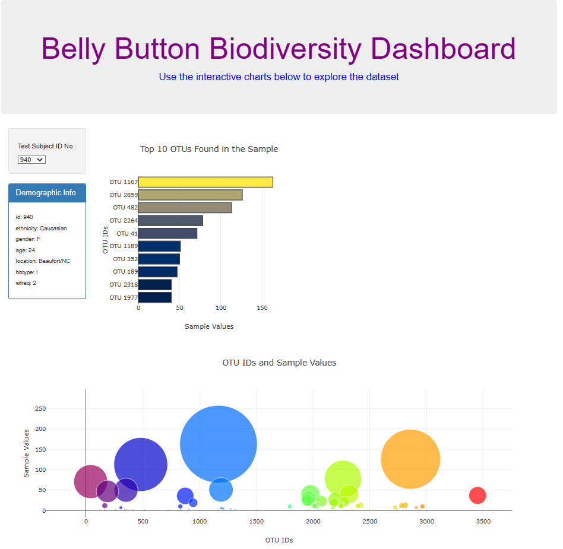

#### "Explore the Microbial Diversity of Belly Buttons with Interactive Visualizations"

# Background

The Belly Button Biodiversity dataset is a comprehensive catalog of microbes found in human navels. This dataset reveals that a small number of microbial species, known as operational taxonomic units (OTUs), are prevalent in more than 70% of individuals, while the remaining species are relatively rare. Exploring this dataset can provide valuable insights into the diversity and composition of microbial communities in human navels.

# Methods

1. Use the D3 library to read the samples.json file from the provided [URL](https://2u-data-curriculum-team.s3.amazonaws.com/dataviz-classroom/v1.1/14-Interactive-Web-Visualizations/02-Homework/samples.json) This file contains the data required for the interactive dashboard.

2. Create a horizontal bar chart with a dropdown menu to display the top 10 OTUs found in a selected individual's navel. The chart should show the following:
   - Use the sample_values as the values for the bar chart.
   - Use the otu_ids as the labels for the bar chart.
   - Use the otu_labels as hovertext for the chart.

3. Create a bubble chart to visualize each sample. The chart should display the following:
   - Use the otu_ids for the x-axis values.
   - Use the sample_values for the y-axis values.
   - Use the sample_values for the marker size.
   - Use the otu_ids for the marker colors.
   - Use the otu_labels for the text values.

4. Display the sample metadata, which includes demographic information about the selected individual.

5. Display each key-value pair from the metadata JSON object on the dashboard, providing additional information about the individual.

6. Ensure that all plots and displayed information are updated dynamically when a new sample is selected. Create a visually appealing layout for the dashboard, presenting the data in an intuitive and user-friendly manner.

# Results

https://mtanguin.github.io/

### Sources:

https://courses.bootcampspot.com/courses/2799/assignments/42892?module_item_id=803534
https://2u-data-curriculum-team.s3.amazonaws.com/dataviz-classroom/v1.1/14-Interactive-Web-Visualizations/02-Homework/samples.json
https://maxcdn.bootstrapcdn.com/bootstrap/3.3.7/css/bootstrap.min.css
https://d3js.org/d3.v5.min.js
https://cdn.plot.ly/plotly-latest.min.js
